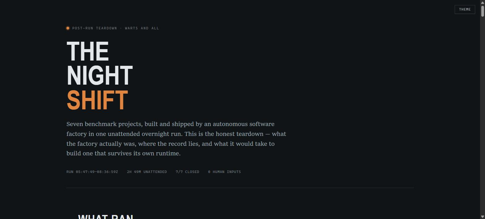

# The Night Shift

Seven software projects built and shipped by an **autonomous software factory** in one unattended overnight run — 2 hours 49 minutes, zero human inputs — followed by an honest teardown of how it worked and where its own record overstates.

**Start here: [FACTORY.md](FACTORY.md)** — the full teardown: the four-loop anatomy, the comparison against a reference cloud factory, sixteen unknown-unknowns, and the blueprint for a factory that survives its own runtime.

The same teardown also exists as an **interactive explorer** — a chart-recorder timeline you can scrub, a kill switch that shows what a dead session loses, a filterable verification matrix, and a scatter plot of the autonomy ceiling. GitHub can't execute a live page inside a README, so the image below is a clickable, repository-owned render — click through for the real thing:

**[Open the interactive explorer](https://nightshift-explorer.vercel.app/)** · source: [factory-explorer.html](factory-explorer.html)

## The run

| # | Project | Deliverable | Verification headline |
|---|---|---|---|
| 7 | Biography | [prompt-07-biography](prompt-07-biography/) | Adversarial claim audit — 0 fabrications |
| 8 | Trailer | [prompt-08-trailer](prompt-08-trailer/) | Shot plan + rendered 31.5 s MP4; continuity gate failed & repaired pre-render |
| 3 | MP3 → MIDI | [live](https://nightshift-mp3-midi.vercel.app/) · [source](prompt-03-mp3-midi/) | 14/14 notes exact vs self-synthesized ground truth |
| 4 | Fighting game | [live](https://nightshift-fighting-game.vercel.app/) · [source](prompt-04-fighting-game/) | 15/15 engine tests; contested best-of-3 vs CPU |
| 9 | Motion explainer | [prompt-09-motion-explainer](prompt-09-motion-explainer/) | 20 s 1080p MP4; frame extraction caught what the linter passed |
| 5 | Watch page | [live](https://nightshift-watch-page.vercel.app/) · [source](prompt-05-watch-page/) | Visual rubric 9/14 FAIL → 12/14 PASS |
| 6 | Tactical FPS | [live](https://nightshift-cs2-clone.vercel.app/) · [source](prompt-06-cs2-clone/) | 18/18 tests incl. dedicated camera-relative-controls suite |

Each project carries its own hardened `docs/spec/execution-contract.md` and an append-only `docs/journey/` ledger. The prompt set (original intent → revised prompt → hardening delta) is in [docs/prompts.md](docs/prompts.md).

## Governance

- [factory-authorization-charter.md](factory-authorization-charter.md) — the batched standing authorization that made the unattended run possible
- [factory-feasibility-assessment.md](factory-feasibility-assessment.md) — the pre-run design
- [factory-state.md](factory-state.md) — final run state

## Model provenance

This wasn't all one model. Which Claude model did which part, reconstructed from actual `/model` switches and commit history rather than assumed:

| Phase | Model |
|---|---|
| The autonomous overnight run itself — prompts 3–9 built, tested, deployed, ledgered | **Fable 5** |
| Factory-status review, `FACTORY.md` authorship, the two research subagents that mined the transcript and workspace | **Opus 4.8** |
| `factory-explorer.html` (first build), the benchmark-reference strip, Vercel renames, the monorepo push, `docs/prompts.md`, first `README.md` | **Fable 5** |
| Live explorer deployment + README preview embed, the repo privacy audit, the §6 source-link fix | **Sonnet 5** |
| This provenance section, and the commit-history correction below | **Opus 4.8** |

Full detail, including two commits that were mislabeled and then corrected, in [FACTORY.md](FACTORY.md#84-model-provenance).

## Credit

The seven work items were adapted from the model-evaluation benchmark by **Pat Simmons** — see [his video](https://www.youtube.com/watch?v=lPP6iBRuzgA). The originals are his; this repo contains the factory's hardened revisions and its builds. The factory experiment itself is unrelated to any particular model under test.

## License

[MIT](LICENSE) for the code and documentation in this repository. That covers the pipelines, tests, source, and every doc — not Pat Simmons's own prompts (paraphrased and linked, never reproduced here — watch his video for the originals) or the AI-generated images/video/audio assets, which may carry their own generation-platform terms.
